# VibeGuard

**Concientización y educación en seguridad para quien crea con IA** — no hace falta ser programador. VibeGuard revisa lo que generaste con tu asistente, te explica los riesgos en palabras simples y te guía paso a paso antes de publicar.

---

## Tabla de contenidos

1. [Resumen ejecutivo](#resumen-ejecutivo)
2. [Público objetivo](#público-objetivo)
3. [El problema que aborda](#el-problema-que-aborda)
4. [Propuesta de valor y giro diferenciador](#propuesta-de-valor-y-giro-diferenciador)
5. [Cómo lo resuelve](#cómo-lo-resuelve)
6. [Flujo del sistema](#flujo-del-sistema)
7. [Funcionamiento en detalle](#funcionamiento-en-detalle)
8. [Experiencia del usuario](#experiencia-del-usuario)
9. [Arquitectura y tecnología](#arquitectura-y-tecnología)
10. [Estructura del proyecto](#estructura-del-proyecto)
11. [Instalación y ejecución](#instalación-y-ejecución)
12. [Límites, alcance y consideraciones éticas](#límites-alcance-y-consideraciones-éticas)
13. [Roadmap](#roadmap)

---

## Resumen ejecutivo

**VibeGuard** es una plataforma web (MVP) pensada para **personas que crean aplicaciones con IA sin ser programadoras ni querer volverse expertas en tecnología**. Su propósito principal no es “auditar como un ingeniero”, sino **concientizar y educar**: ayudar a entender qué puede salir mal cuando publicás algo hecho con ChatGPT, Copilot u otras herramientas, y qué hacer al respecto en lenguaje cotidiano.

El usuario entrega lo que generó (código pegado, carpeta en ZIP o enlace de GitHub). El sistema lo revisa **sin ejecutarlo** y devuelve:

- Un **puntaje de seguridad** (0–100) con semáforo visual (verde / amarillo / rojo) — fácil de interpretar sin jerga.
- **Explicaciones en español claro** por cada alerta: qué significa, por qué importa y qué conviene hacer.
- **Áreas de riesgo agrupadas** con nombres entendibles (basadas en OWASP, pero explicadas como “tipos de problema”, no como estándares técnicos).
- **Módulos de aprendizaje** (lecciones, checklist y quiz) para reforzar hábitos seguros, cuando hay IA configurada.
- Un **reporte descargable** para compartir o revisar con alguien de confianza.

El análisis automático es el medio; **la educación y la conciencia** son el fin. No reemplaza auditorías profesionales: es un **acompañamiento accesible** antes de publicar o compartir tu proyecto.

---

## Público objetivo

### ¿Para quién es VibeGuard?

| Perfil | Descripción |
|--------|-------------|
| **Creadores con IA** | Emprendedores, estudiantes, diseñadores, marketers o curiosos que “vibe codean”: piden a la IA que arme una app y la publican sin revisar seguridad. |
| **Sin formación técnica** | No necesitan saber programar, leer código con fluidez ni dominar conceptos como inyección SQL o SSRF. |
| **Sin intención de ser devs** | No buscan carrera en desarrollo ni profundizar en arquitectura; quieren **lanzar su idea con más tranquilidad**. |
| **Consumidores responsables de IA** | Quieren usar IA para crear, pero también **entender los riesgos básicos** de exponer datos, claves o usuarios. |

### ¿Para quién no está pensado (como producto principal)?

- Equipos de seguridad (SecOps) que necesitan scanners enterprise.
- Programadores senior que ya usan SAST/CI integrado y leen informes técnicos densos.

*(El equipo puede usar el mismo motor por detrás, pero la experiencia y el mensaje están diseñados para el usuario no técnico.)*

---

## El problema que aborda

### Contexto: crear con IA sin saber “lo que hay debajo”

Millones de personas hoy **no escriben código**: lo **piden** a un asistente de IA, copian el resultado, lo adaptan con más prompts y lo suben a internet. Eso abre una brecha nueva:

- No saben si en el proyecto quedó una **contraseña o clave visible**.
- No entienden si la app **deja ver datos de otros usuarios**.
- No perciben que un archivo de configuración **filtrado** puede comprometer cuentas reales.
- Confían en que “si la IA lo hizo, debe estar bien” — y **no es así**.

| Lo que suele pasar (en simple) | Qué puede ocurrir en la vida real |
|--------------------------------|-----------------------------------|
| Claves o tokens dentro del proyecto | Alguien entra a tu cuenta, API o base de datos |
| Piezas del proyecto desactualizadas o raras | Puertas abiertas que ni la IA te avisó |
| La app acepta entradas sin filtrar | Robo o borrado de información |
| Archivos con secretos subidos al repo | Cualquiera en internet puede reutilizarlos |
| Login o permisos mal hechos | Un usuario ve lo que no debería ver |

### Brecha que cierra VibeGuard

Las herramientas de seguridad tradicionales hablan el idioma de **ingenieros y hackers éticos**: severidades, CVEs, reglas opacas. Quien vibe codea necesita otra cosa:

1. **Entender** qué está en juego, sin curso previo de ciberseguridad.
2. **Priorizar** qué arreglar primero, con un puntaje y un semáforo.
3. **Aprender** mientras corrige, no solo recibir una lista de errores.
4. **Actuar** con pasos concretos (o saber cuándo pedir ayuda a alguien técnico).

**VibeGuard** ocupa ese espacio: **educación y concientización primero**, análisis automático como soporte — pensado para quien crea con IA y no aspira a ser programador.

---

## Propuesta de valor y giro diferenciador

### Propuesta de valor

> *“Creá con IA, pero publicá sabiendo qué riesgos llevás — te lo explicamos como a una persona, no como a un ingeniero.”*

### Diferenciador principal: educar, no solo escanear

La mayoría de herramientas del mercado se centran en **detectar vulnerabilidades**. VibeGuard se centra en **formar criterio**:

| Otros enfoques | VibeGuard |
|----------------|-----------|
| Informe técnico para quien ya programa | Informe narrativo para quien **creó con prompts** |
| “Corregí la regla X en la línea Y” | “Esto es como dejar la llave puesta; hacé esto…” |
| El valor termina en el scan | El valor continúa en **lecciones, checklist y quiz** |
| Asume que querés ser más técnico | Asume que querés **estar más seguro sin volverte dev** |

El escaneo responde: *¿hay problemas?*  
La capa educativa responde: *¿por qué me importa y qué hago, aunque no entienda el código?*

### Otros aspectos que nos distinguen

| Aspecto | Enfoque de VibeGuard |
|---------|----------------------|
| **Audiencia** | Personas que vibe codean **sin ser programadoras** |
| **Lenguaje** | Metáforas, “misiones”, rangos como “Guardián digital” — OWASP traducido a ideas cotidianas |
| **Prioridad del producto** | Concientización → educación → puntaje e informe → (opcional) profundizar |
| **Entrada flexible** | Pegar lo que dio la IA, subir ZIP o enlazar GitHub — sin terminal ni IDE |
| **Sin ejecución** | Solo se lee el proyecto; no se corre tu app en nuestro servidor |
| **Honestidad del MVP** | Heurísticas acotadas; no promete detectar todo ni sustituir expertos |

### Modelo de negocio potencial (visión)

- **Freemium educativo**: análisis + explicaciones básicas gratis; minicursos y guías ampliadas con IA premium.
- **Alianzas con plataformas de IA / no-code**: aviso de seguridad antes de publicar desde el mismo flujo de creación.
- **Contenido y talleres**: rutas de “seguridad mínima viable” para creadores que no quieren estudiar programación.
- **B2B ligero**: equipos que habilitan IA a perfiles no técnicos y necesitan concientización, no solo compliance técnico.

*(El repositorio actual es un MVP demostrativo; el historial de análisis se guarda principalmente en el navegador del usuario.)*

---

## Cómo lo resuelve

VibeGuard combina **capa educativa y de concientización** con **detección automática** y clasificación por tipos de riesgo (OWASP, presentados en lenguaje accesible):

```
Código del usuario  →  Ingesta (leer archivos)  →  Motores de análisis
        →  Agregación y puntaje  →  Explicaciones  →  Informe + aprendizaje
```

1. **Recibe** lo que el usuario creó (texto pegado, ZIP o GitHub) — sin pedir conocimientos previos.
2. **Revisa** el contenido con motores automáticos (patrones de riesgo conocidos).
3. **Calcula** un puntaje y semáforo fáciles de leer.
4. **Traduce** cada hallazgo a lenguaje humano: qué es, por qué importa, impacto y qué hacer.
5. **Agrupa** problemas por “áreas” entendibles (basadas en OWASP, con nombres y descripciones simples).
6. **Ofrece aprendizaje** hasta 3 minicursos según lo más urgente del informe.
7. **Entrega** un informe visual y descargable para revisar o compartir.

---

## Flujo del sistema

### Flujo de alto nivel

```mermaid
flowchart TB
    subgraph Usuario
        A[Pegar código / ZIP / URL GitHub]
        B[Clic en Analizar]
    end

    subgraph Frontend["Cliente (React + Vite)"]
        C[Envío a POST /api/analyze]
        D[Visualización del informe]
        E[Historial local / Descarga reporte]
    end

    subgraph Backend["Servidor (Express)"]
        F[Ingesta: raw | zip | github]
        G[Pipeline de motores]
        H[Agregación de riesgo]
        I[Explicaciones educativas]
        J[Agrupación OWASP]
        K[Módulos de aprendizaje]
    end

    A --> B --> C --> F --> G --> H --> I --> J --> K
    K --> C --> D --> E
```

### Flujo por modo de entrada

| Modo | Qué envía el usuario | Qué hace el servidor |
|------|----------------------|----------------------|
| **Raw** | JSON con fragmento de código y nombre de archivo opcional | Analiza ese contenido como un único archivo |
| **ZIP** | `multipart/form-data` con archivo `.zip` | Descomprime en temporal, filtra archivos, analiza y borra temporales |
| **GitHub** | JSON con URL del repo (+ token opcional del usuario) | Descarga archivos del repo público/privado vía API de GitHub |

### Flujo de autenticación (opcional)

```mermaid
sequenceDiagram
    participant U as Usuario
    participant F as Frontend
    participant S as Supabase Auth
    participant G as GitHub API

    U->>F: Iniciar sesión con GitHub
    F->>S: OAuth GitHub
    S-->>F: Sesión + token de proveedor
    F->>G: Listar repositorios del usuario
    G-->>F: Lista de repos
    U->>F: Elegir repo y analizar
    F->>F: POST /api/analyze con URL + token
```



La sesión con GitHub permite analizar **repos privados** del usuario y listar sus repositorios desde la interfaz. El perfil básico se sincroniza en Supabase (`upsert` de usuario, último login).

---

## Funcionamiento en detalle

### 1. Ingesta de código

El módulo de ingestión normaliza la entrada en una lista de **snapshots de archivo** (`ruta` + `contenido`):

- **Límites operativos**: hasta ~5 MB de contenido combinado, máximo 200 archivos, ZIP hasta 10 MB.
- **Extensiones permitidas**: `.js`, `.ts`, `.tsx`, `.py`, `.json`, `.yaml`, `.env`, etc.
- **Carpetas ignoradas**: `node_modules`, `.git`, `dist`, `build`, `.next`, etc.
- **Seguridad de plataforma**: no ejecuta el código del usuario; mitigación básica de Zip Slip; URLs de GitHub restringidas a `github.com`.

### 2. Motores de análisis (heurísticas)

Cada motor escanea el texto de los archivos y emite **hallazgos** (`findings`) con regla, severidad, archivo, línea y categoría OWASP:

| Motor | Qué detecta (ejemplos) |
|-------|-------------------------|
| `secrets` | API keys, tokens, contraseñas en código |
| `secretsAdvanced` | Patrones avanzados de secretos |
| `deps` | Dependencias vulnerables o sospechosas en lockfiles |
| `patterns` | Prácticas inseguras generales |
| `configExposure` | Exposición en archivos de configuración |
| `injection` | Riesgos de inyección (SQL, comandos, etc.) |
| `integrity` | Deserialización insegura, integridad de datos |
| `accessControl` | Control de acceso débil |
| `authFailures` | Fallas de autenticación y sesión |
| `logging` | Logging inadecuado o que filtra datos sensibles |
| `ssrf` | Server-Side Request Forgery |

### 3. Agregación y puntaje

- Se **fusionan** todos los hallazgos y se **deduplican** por regla, archivo y línea.
- Se calcula un **risk score** ponderado (alta / media / baja severidad).
- **secureScore** = 100 − riskScore.
- **Semáforo**:
  - Verde: secureScore ≥ 72
  - Amarillo: 38–71
  - Rojo: &lt; 38

En la UI se traduce a rangos como “Guardián digital”, “En entrenamiento” o “Modo alerta”.

### 4. Explicaciones educativas (núcleo del producto)

Cada hallazgo se convierte en una **micro-lección**, no en un error críptico. El usuario ve:

- **Qué es** el problema (sin asumir que conoce el término técnico)
- **Por qué** le importa a *su* proyecto
- **Qué podría pasar** si no lo atiende
- **Qué hacer** a continuación (o cuándo pedir ayuda)

**Sin API de IA**: plantillas en español claro, pensadas para lectura no técnica.  
**Con `OPENAI_API_KEY`**: textos adaptados al contexto del análisis (opcional).

### 5. Agrupación por áreas de riesgo (OWASP en lenguaje simple)

Por detrás se usa el estándar **OWASP Top 10 (2021)**; hacia el usuario se muestran como **áreas con nombre y descripción cotidiana**, sin exigir que conozca el estándar. Ejemplos:

- **A01** — Control de acceso roto  
- **A02** — Fallas criptográficas (secretos expuestos)  
- **A03** — Inyección  
- **A06** — Componentes vulnerables  
- … hasta **A10** — SSRF  

Solo aparecen categorías con al menos un hallazgo, ordenadas por gravedad.

### 6. Aprendizaje premium

Si hay clave de IA configurada, el sistema puede generar **hasta 3 minicursos** sobre los temas más urgentes del informe de *esa* persona, cada uno con:

- Lección en lenguaje simple (sin prerequisitos de programación)  
- Checklist de acciones concretas  
- Quiz para verificar que entendió la idea, no la sintaxis  

Así el diferenciador educativo se extiende más allá del informe puntual: el usuario **sale sabiendo un poco más** que cuando entró.

### 7. Salida del análisis

La API devuelve un objeto `AnalysisResult` que incluye:

- `secureScore`, `riskScore`, `trafficLight`
- `findings` (lista plana)
- `categories` (agrupadas por OWASP)
- `limits` (archivos procesados, advertencias, truncado)
- `usedAiExplanation`
- `markdownReport`
- `learningPremium`, `learningModules` (si aplica)

---

## Experiencia del usuario

Diseñada para que **no haga falta entender programación** para sacar valor del recorrido.

### Pantalla principal

1. Elige cómo entregar su proyecto: **pegar lo que generó la IA**, **subir un ZIP** o **enlazar GitHub** (sin terminal ni comandos).
2. Si quiere, inicia sesión con GitHub para elegir un repo de una lista — útil si la IA le ayudó a subir el código ahí.
3. Pulsa **Analizar** y espera; el sistema hace el trabajo técnico por detrás.

### Pantalla de resultados (pensada para aprender, no solo asustar)

- **Puntaje grande y semáforo**: “¿Qué tan protegida está mi app?” de un vistazo.
- **Mensaje en criollo**: por ejemplo, “Tenés 2 misiones urgentes” en lugar de solo códigos de error.
- **Áreas de riesgo**: cada bloque explica *de qué se trata ese tipo de problema* antes de mostrar detalles.
- **Cada alerta como mini-lección**: qué pasó, por qué importa y qué hacer — sin asumir que el usuario leyó el código.
- **Pestaña Aprendizaje**: lecciones cortas, checklist y quiz para fijar conceptos.
- **Descargar reporte** para guardarlo o mostrárselo a alguien que sí programe.
- **Nuevo análisis** cuando corrija y quiera volver a comprobar.

### Funciones auxiliares

- **Historial**: volver a ver análisis anteriores (guardado en el navegador).
- **Guía “Cómo usar este informe”**: tres pasos sin jerga (puntaje → áreas → aprendizaje).
- **Tema** claro u oscuro.

---

## Arquitectura y tecnología

### Vista general

```
┌─────────────────────────────────────────────────────────┐
│  Cliente (puerto 5173 en desarrollo)                    │
│  React 18 · TypeScript · Vite · Tailwind CSS 4        │
│  Supabase Auth (GitHub OAuth) · localStorage            │
└──────────────────────────┬──────────────────────────────┘
                           │ HTTP /api/* (proxy Vite → 8787)
┌──────────────────────────▼──────────────────────────────┐
│  Servidor (puerto 8787)                                 │
│  Node.js · Express · TypeScript · Zod                   │
│  Multer (ZIP) · unzipper · motores heurísticos          │
│  OpenAI API opcional                                    │
└──────────────────────────┬──────────────────────────────┘
                           │
         ┌─────────────────┼─────────────────┐
         ▼                 ▼                 ▼
   GitHub API        OpenAI API         Supabase
   (repos/código)   (explicaciones)    (auth/perfil)
```

### Stack y rol de cada tecnología

| Tecnología | Dónde | Para qué se usa |
|------------|-------|------------------|
| **React 18** | Cliente | Interfaz SPA: formularios, informe, historial, aprendizaje |
| **Vite 5** | Cliente | Dev server, build, proxy `/api` → backend |
| **TypeScript** | Cliente y servidor | Tipado compartido de contratos (análisis, OWASP, learning) |
| **Tailwind CSS 4** | Cliente | Diseño Material-inspired, temas claro/oscuro |
| **Express 4** | Servidor | API REST (`GET /health`, `POST /api/analyze`) |
| **Zod** | Servidor | Validación de body JSON y esquemas de respuesta |
| **Multer + unzipper** | Servidor | Subida y extracción segura de archivos ZIP |
| **dotenv** | Servidor | Variables de entorno (IA, GitHub, CORS, puerto) |
| **Supabase** | Cliente | Autenticación OAuth con GitHub, perfil de usuario |
| **OpenAI-compatible API** | Servidor | Explicaciones enriquecidas y módulos de aprendizaje |
| **GitHub API** | Servidor + cliente | Clonar contenido de repos; listar repos del usuario autenticado |
| **concurrently** | Raíz | Ejecutar cliente y servidor en paralelo con `npm run dev` |

### API principal

| Endpoint | Método | Descripción |
|----------|--------|-------------|
| `/health` | GET | Estado del servicio y si learning premium está activo |
| `/api/analyze` | POST | Análisis según modo: JSON (`raw` / `github`) o multipart (`file` ZIP) |

### Variables de entorno

**Servidor** (`server/.env` — ver `server/.env.example`):

| Variable | Obligatoria | Uso |
|----------|-------------|-----|
| `PORT` | No (default 8787) | Puerto del API |
| `CLIENT_ORIGIN` | No | CORS para el frontend |
| `OPENAI_API_KEY` | No | Habilita IA en explicaciones y cursos |
| `OPENAI_BASE_URL`, `OPENAI_MODEL` | No | Proveedor compatible con OpenAI |
| `GITHUB_TOKEN` | No | Mayor límite de rate en API de GitHub |

**Cliente** (`client/.env.local` — ver `client/.env.example`):

| Variable | Uso |
|----------|-----|
| `VITE_SUPABASE_URL` | Proyecto Supabase |
| `VITE_SUPABASE_ANON_KEY` | Clave pública para auth |
| `VITE_APP_URL` | Redirect OAuth en producción |

Guía detallada de OAuth: [`GITHUB_OAUTH_SETUP.md`](GITHUB_OAUTH_SETUP.md).

---

## Estructura del proyecto

```
hack-latam/
├── client/                 # Frontend React + Vite
│   └── src/
│       ├── App.tsx         # Flujo principal, tabs, auth, historial
│       ├── components/     # Informe, tarjetas, aprendizaje, puntaje
│       ├── services/       # API de análisis, cliente Supabase
│       ├── hooks/          # Progreso de aprendizaje
│       └── types/          # Tipos del informe
├── server/                 # Backend Express
│   └── src/
│       ├── index.ts        # Servidor HTTP y rutas
│       ├── ingest/         # raw, zip, github
│       ├── engines/        # Motores de detección + pipeline
│       ├── explain/        # Plantillas, IA, aprendizaje
│       └── schemas/        # Contratos Zod (findings, OWASP, learning)
├── package.json            # Scripts raíz (dev, build, start)
├── GITHUB_OAUTH_SETUP.md
└── README.md
```

---

## Instalación y ejecución

### Requisitos

- **Node.js 18+**

### Pasos rápidos

```bash
# Desde la raíz del repositorio
npm install
cd server && npm install && cd ..
cd client && npm install && cd ..

# Configurar entorno (opcional pero recomendado)
cp server/.env.example server/.env
cp client/.env.example client/.env.local

# Desarrollo: servidor (8787) + cliente (5173)
npm run dev
```

Abrir la app en **`http://127.0.0.1:5173`** (recomendado frente a `localhost` por el proxy).

### Scripts disponibles

| Comando | Descripción |
|---------|-------------|
| `npm run dev` | Cliente y servidor en paralelo |
| `npm run build` | Compila TypeScript del servidor + build Vite del cliente |
| `npm run start` | Servidor en modo producción (tras `build`) |

### Documentación técnica adicional

- [`server/docs/API_PARA_FRONTEND.md`](server/docs/API_PARA_FRONTEND.md) — Contrato de la API para el frontend  
- [`server/docs/EXPORTAR_REPORTE_FRONTEND.md`](server/docs/EXPORTAR_REPORTE_FRONTEND.md) — Exportación de reportes  

---

## Límites, alcance y consideraciones éticas

### Alcance del MVP

- Motor basado en **reglas y heurísticas**, no en análisis estático profundo ni SAST enterprise.
- Puede producir **falsos positivos** (alertas que no aplican) y **falsos negativos** (riesgos no detectados).
- Proyectos muy grandes se **truncan** según límites de tamaño y cantidad de archivos.
- El historial de análisis vive principalmente en el **navegador**, no en una base de datos central de informes.

### Seguridad de la plataforma

- El código del usuario **no se ejecuta** en el servidor.
- Solo se lee contenido textual y metadatos de archivos.
- Medidas básicas contra ZIP maliciosos y SSRF limitado a hosts de GitHub válidos.

### Uso responsable

> Este repositorio **no sustituye** pentests profesionales, revisiones de compliance ni la validación humana final antes de manejar datos personales o desplegar en producción.

---

## Roadmap

Funcionalidades previstas, alineadas con el público no técnico:

- Más contenido educativo sin jerga (videos cortos, analogías, “qué decirle a la IA para arreglarlo”)  
- Integración con flujos no-code / asistentes de IA (“revisá antes de publicar”)  
- Alertas aún más accionables para quien no lee código (botones “copiar prompt de arreglo”)  
- Historial en la nube y compartir informe con un mentor o soporte técnico  
- Cobertura de más tipos de proyecto con el mismo lenguaje simple  

*(Mejoras técnicas internas — OSV, parsers infra, CI — pueden sumarse sin cambiar el foco en educación.)*

---

## Licencia y créditos

Proyecto desarrollado en el contexto de **Hack Latam** como herramienta de **concientización y educación en seguridad** para personas que crean con IA **sin ser programadoras** y sin pretender volverse expertas técnicas.

---

### In a Nutshell

> *VibeGuard es para quien crea apps con IA pero no es programador: revisamos lo que generaste, te damos un puntaje fácil de entender y te explicamos los riesgos en palabras simples, con lecciones y pasos concretos. No queremos convertirte en hacker — queremos que publiques con más conciencia y menos sustos.*
